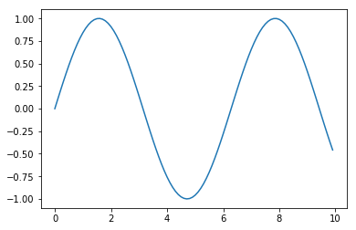
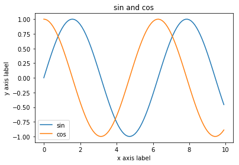
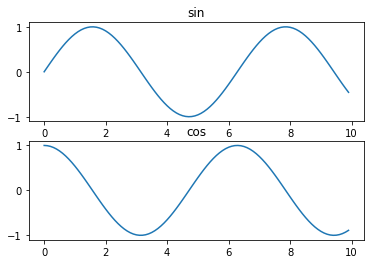

.. code:: ipython2

    #######벡터, 행렬 연산, 그래프 그리기 201811194 이진욱######
    
    import numpy as np
    import sys
    print "Python version : ", sys.version

.. parsed-literal::

    Python version :  2.7.16 |Anaconda, Inc.| (default, Sep 24 2019, 21:51:30) 
    [GCC 7.3.0]

.. code:: ipython2

    #프린트
    def print_val(x):
        print "Type : ", type(x)
        print "Shape : ", x.shape
        print "값 : \n", x
        print " "

.. code:: ipython2

    print("rank 1 np array\n")
    x = np.array([1, 2, 3])
    print_val(x)
    
    x[0] = 5
    print_val(x)

.. parsed-literal::

    rank 1 np array
    
    Type :  <type 'numpy.ndarray'>
    Shape :  (3,)
    값 : 
    [1 2 3]
     
    Type :  <type 'numpy.ndarray'>
    Shape :  (3,)
    값 : 
    [5 2 3]
     

.. code:: ipython2

    print("rank 2 np array\n")
    y = np.array([[1, 2, 3], [4, 5, 6]])
    print_val(y)
    
    print("rank 2 ones\n")
    a = np.ones((3,2))
    print_val(a)
    
    print("rank 2 zeros\n")
    a = np.zeros((2,2))
    print_val(a)
    
    print("rank 2 identity matrix\n")
    a = np.eye(3,3)
    print_val(a)

.. parsed-literal::

    rank 2 np array
    
    Type :  <type 'numpy.ndarray'>
    Shape :  (2, 3)
    값 : 
    [[1 2 3]
     [4 5 6]]
     
    rank 2 ones
    
    Type :  <type 'numpy.ndarray'>
    Shape :  (3, 2)
    값 : 
    [[1. 1.]
     [1. 1.]
     [1. 1.]]
     
    rank 2 zeros
    
    Type :  <type 'numpy.ndarray'>
    Shape :  (2, 2)
    값 : 
    [[0. 0.]
     [0. 0.]]
     
    rank 2 identity matrix
    
    Type :  <type 'numpy.ndarray'>
    Shape :  (3, 3)
    값 : 
    [[1. 0. 0.]
     [0. 1. 0.]
     [0. 0. 1.]]
     

.. code:: ipython2

    print("랜덤 행렬 - uniform\n")
    a = np.random.random((4,4))
    print_val(a)
    
    print("랜덤 행렬 - Gaussian\n")
    a = np.random.randn(4,4)
    print_val(a)

.. parsed-literal::

    랜덤 행렬 - uniform
    
    Type :  <type 'numpy.ndarray'>
    Shape :  (4, 4)
    값 : 
    [[0.37063666 0.9644657  0.86170537 0.09119828]
     [0.04275434 0.84952616 0.55850984 0.6268978 ]
     [0.8329601  0.60850287 0.72209475 0.74987002]
     [0.69576765 0.66717626 0.55714304 0.25499928]]
     
    랜덤 행렬 - Gaussian
    
    Type :  <type 'numpy.ndarray'>
    Shape :  (4, 4)
    값 : 
    [[ 2.33243297  0.01876756 -0.28434551  0.076589  ]
     [-0.34853875 -1.31799513 -1.70649937  1.10807494]
     [ 0.15586005 -0.05917462 -0.13095556 -0.46660992]
     [ 2.05411001  0.44733383  1.56090075 -1.53209385]]
     

.. code:: ipython2

    print("np array indexing\n")
    a = np.array([[1,2,3,4], [5,6,7,8], [9,10,11,12]])
    print_val(a)
    
    b = a[:2, 1:3]
    print_val(b)
    
    print("행렬의 n번째 행 얻기\n")
    row1 = a[1, :]
    print_val(row1)

.. parsed-literal::

    np array indexing
    
    Type :  <type 'numpy.ndarray'>
    Shape :  (3, 4)
    값 : 
    [[ 1  2  3  4]
     [ 5  6  7  8]
     [ 9 10 11 12]]
     
    Type :  <type 'numpy.ndarray'>
    Shape :  (2, 2)
    값 : 
    [[2 3]
     [6 7]]
     
    행렬의 n번째 행 얻기
    
    Type :  <type 'numpy.ndarray'>
    Shape :  (4,)
    값 : 
    [5 6 7 8]
     

.. code:: ipython2

    print("행렬의 원소별 연산\n")
    m1 = np.array([[1,2], [3,4]], dtype=np.float64)
    m2 = np.array([[5,6], [7,8]], dtype=np.float64)
    
    print("ADD\n")
    print_val(m1 + m2)
    print_val(np.add(m1, m2))
    
    
    print("SUBTRACT\n")
    print_val(m1 - m2)
    print_val(np.subtract(m1, m2))
    
    
    print("PRODUCT\n")
    print_val(m1 * m2)
    print_val(np.multiply(m1, m2))
    
    
    print("DIVISION\n")
    print_val(m1 / m2)
    print_val(np.divide(m1, m2))
    
    
    print("SQURE ROOT\n")
    print_val(np.sqrt(m1))

.. parsed-literal::

    행렬의 원소별 연산
    
    ADD
    
    Type :  <type 'numpy.ndarray'>
    Shape :  (2, 2)
    값 : 
    [[ 6.  8.]
     [10. 12.]]
     
    Type :  <type 'numpy.ndarray'>
    Shape :  (2, 2)
    값 : 
    [[ 6.  8.]
     [10. 12.]]
     
    SUBTRACT
    
    Type :  <type 'numpy.ndarray'>
    Shape :  (2, 2)
    값 : 
    [[-4. -4.]
     [-4. -4.]]
     
    Type :  <type 'numpy.ndarray'>
    Shape :  (2, 2)
    값 : 
    [[-4. -4.]
     [-4. -4.]]
     
    PRODUCT
    
    Type :  <type 'numpy.ndarray'>
    Shape :  (2, 2)
    값 : 
    [[ 5. 12.]
     [21. 32.]]
     
    Type :  <type 'numpy.ndarray'>
    Shape :  (2, 2)
    값 : 
    [[ 5. 12.]
     [21. 32.]]
     
    DIVISION
    
    Type :  <type 'numpy.ndarray'>
    Shape :  (2, 2)
    값 : 
    [[0.2        0.33333333]
     [0.42857143 0.5       ]]
     
    Type :  <type 'numpy.ndarray'>
    Shape :  (2, 2)
    값 : 
    [[0.2        0.33333333]
     [0.42857143 0.5       ]]
     
    SQURE ROOT
    
    Type :  <type 'numpy.ndarray'>
    Shape :  (2, 2)
    값 : 
    [[1.         1.41421356]
     [1.73205081 2.        ]]
     

.. code:: ipython2

    print("행렬 연산\n")
    m1 = np.array([[1,2], [3,4]])
    m2 = np.array([[5,6], [7,8]])
    v1 = np.array([9,10])
    v2 = np.array([11,12])
    
    print_val(m1)
    print_val(m2)
    print_val(v1)
    print_val(v2)

.. parsed-literal::

    행렬 연산
    
    Type :  <type 'numpy.ndarray'>
    Shape :  (2, 2)
    값 : 
    [[1 2]
     [3 4]]
     
    Type :  <type 'numpy.ndarray'>
    Shape :  (2, 2)
    값 : 
    [[5 6]
     [7 8]]
     
    Type :  <type 'numpy.ndarray'>
    Shape :  (2,)
    값 : 
    [ 9 10]
     
    Type :  <type 'numpy.ndarray'>
    Shape :  (2,)
    값 : 
    [11 12]
     

.. code:: ipython2

    print("벡터-벡터 연산\n")
    print_val(v1.dot(v2))
    print_val(np.dot(v1,v2))

.. parsed-literal::

    벡터-벡터 연산
    
    Type :  <type 'numpy.int64'>
    Shape :  ()
    값 : 
    219
     
    Type :  <type 'numpy.int64'>
    Shape :  ()
    값 : 
    219
     

.. code:: ipython2

    print("벡터-행렬 연산\n")
    print_val(m1.dot(v1))
    print_val(np.dot(m1,v1))

.. parsed-literal::

    벡터-행렬 연산
    
    Type :  <type 'numpy.ndarray'>
    Shape :  (2,)
    값 : 
    [29 67]
     
    Type :  <type 'numpy.ndarray'>
    Shape :  (2,)
    값 : 
    [29 67]
     

.. code:: ipython2

    print("행렬-행렬 연산\n")
    print_val(m1.dot(m2))
    print_val(np.dot(m1,m2))

.. parsed-literal::

    행렬-행렬 연산
    
    Type :  <type 'numpy.ndarray'>
    Shape :  (2, 2)
    값 : 
    [[19 22]
     [43 50]]
     
    Type :  <type 'numpy.ndarray'>
    Shape :  (2, 2)
    값 : 
    [[19 22]
     [43 50]]
     

.. code:: ipython2

    print("전치 행렬\n")
    print_val(m1)
    print_val(m1.T)

.. parsed-literal::

    전치 행렬
    
    Type :  <type 'numpy.ndarray'>
    Shape :  (2, 2)
    값 : 
    [[1 2]
     [3 4]]
     
    Type :  <type 'numpy.ndarray'>
    Shape :  (2, 2)
    값 : 
    [[1 3]
     [2 4]]
     

.. code:: ipython2

    print("합\n")
    print_val(np.sum(m1))
    
    print("압축\n")
    print_val(np.sum(m1, axis=0))
    print_val(np.sum(m1, axis=1))
    
    m1 = np.array([[1,2,3],[4,5,6]])
    print_val(m1)
    
    print_val(np.sum(m1))
    print_val(np.sum(m1, axis=0))
    print_val(np.sum(m1, axis=1))

.. parsed-literal::

    합
    
    Type :  <type 'numpy.int64'>
    Shape :  ()
    값 : 
    10
     
    압축
    
    Type :  <type 'numpy.ndarray'>
    Shape :  (2,)
    값 : 
    [4 6]
     
    Type :  <type 'numpy.ndarray'>
    Shape :  (2,)
    값 : 
    [3 7]
     
    Type :  <type 'numpy.ndarray'>
    Shape :  (2, 3)
    값 : 
    [[1 2 3]
     [4 5 6]]
     
    Type :  <type 'numpy.int64'>
    Shape :  ()
    값 : 
    21
     
    Type :  <type 'numpy.ndarray'>
    Shape :  (3,)
    값 : 
    [5 7 9]
     
    Type :  <type 'numpy.ndarray'>
    Shape :  (2,)
    값 : 
    [ 6 15]
     

.. code:: ipython2

    print("zeros-like\n")
    m1 = np.array([[1,2,3], [4,5,6], [7,8,9], [10,11,12]])
    m2 = np.zeros_like(m1)
    print_val(m1)
    print_val(m2)

.. parsed-literal::

    zeros-like
    
    Type :  <type 'numpy.ndarray'>
    Shape :  (4, 3)
    값 : 
    [[ 1  2  3]
     [ 4  5  6]
     [ 7  8  9]
     [10 11 12]]
     
    Type :  <type 'numpy.ndarray'>
    Shape :  (4, 3)
    값 : 
    [[0 0 0]
     [0 0 0]
     [0 0 0]
     [0 0 0]]
     

.. code:: ipython2

    print("Matplot library\n")
    import matplotlib.pyplot as plt
    %matplotlib inline
    
    x = np.arange(0,10,0.1)
    y = np.sin(x)
    
    plt.plot(x,y)

.. parsed-literal::

    Matplot library
    

.. parsed-literal::

    [<matplotlib.lines.Line2D at 0x7fc41d7a27d0>]

.. code:: ipython2

    print("한 번에 두 개 그래프 그리기\n")
    
    y_sin = np.sin(x)
    y_cos = np.cos(x)
    
    plt.plot(x, y_sin)
    plt.plot(x, y_cos)
    plt.xlabel('x axis label')
    plt.ylabel('y axis label')
    plt.title('sin and cos')
    plt.legend(['sin', 'cos'])
    
    plt.show()

.. parsed-literal::

    한 번에 두 개 그래프 그리기
    

.. code:: ipython2

    print("Subplot\n")
    plt.subplot(2,1,1)
    plt.plot(x, y_sin)
    plt.title('sin')
    
    plt.subplot(2, 1, 2)
    plt.plot(x, y_cos)
    plt.title('cos')
    
    plt.show()

.. parsed-literal::

    Subplot
    

